<!-- Animated hero (name + taglines rendered INSIDE the SVG): drone, scout drone,
     drone swarm, rover, robot dog, robotic arm, satellite, sweeping radar.
     Borderless; theme-aware via <picture>. -->

  <picture>
    <source media="(prefers-color-scheme: light)" srcset="./assets/hero-light.svg">
    
  </picture>

  

  
  
  
  

⚙️ I’m a technologist focused on building <b>production-ready intelligent systems</b> that operate in real-world environments.  
My work sits at the intersection of <b>AI, robotics, embedded systems, and software engineering</b>, where ideas evolve from <b>concept → prototype → scalable platforms</b>.

<!-- Typing terminal card: whoami, focus, build pipeline, availability.
     Theme-aware: dark terminal on dark mode, light terminal on light mode. -->

  <picture>
    <source media="(prefers-color-scheme: light)" srcset="./assets/terminal-light.svg">
    
  </picture>

<!-- Animated capabilities: one live icon per skill tag below -->

  <picture>
    <source media="(prefers-color-scheme: light)" srcset="./assets/capabilities-light.svg">
    
  </picture>

  
  
  
  
  
  
  

 

<b>🌱 Beyond Development & Deployment</b>

<!-- Animated interests -->

  <picture>
    <source media="(prefers-color-scheme: light)" srcset="./assets/beyond-light.svg">
    
  </picture>

  
  
  

<b>I believe <b>learning never stops</b>, and that sharing knowledge accelerates innovation.

 

  
  
  

  

  <i>Building innovative solutions at the intersection of AI, robotics, and emerging technologies.</i>

<!-- Animated footer: comms towers, rover convoy, satellite, rocket launch.
     Borderless; theme-aware. -->

  <picture>
    <source media="(prefers-color-scheme: light)" srcset="./assets/footer-light.svg">
    
  </picture>

